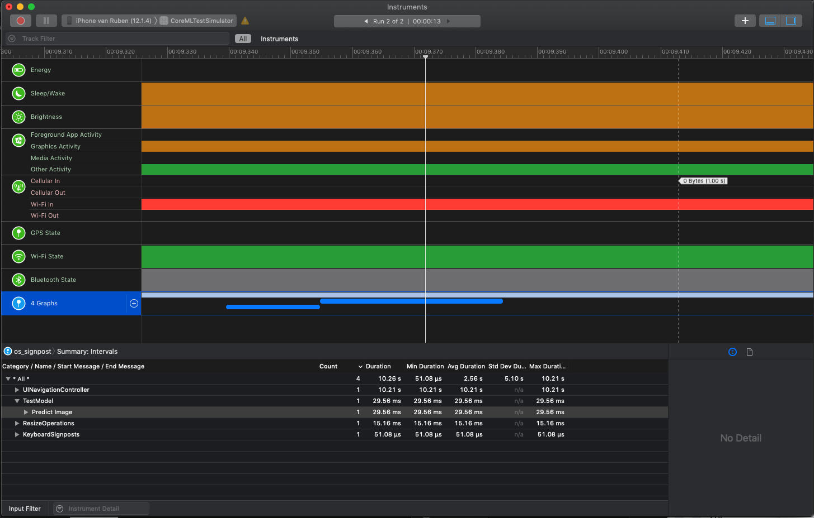
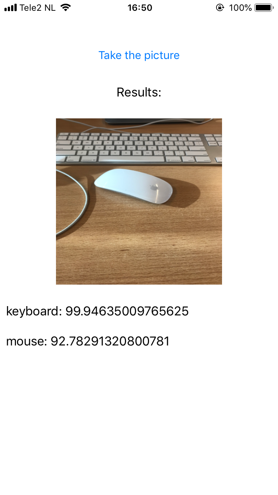

#CoreML Test Simulator
This project can compare the Inceptionv3, MobileNet, Resnet50 and Yolov3. You can measure the speed using [os_signpost](https://developer.apple.com/documentation/os/3019241-os_signpost).

##Installation

Unzip the Resnet50 and Yolov3 models to start the project.